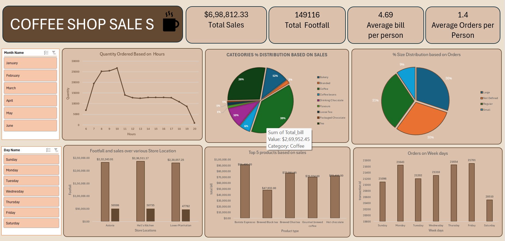

# ☕ Coffee Shop Sales Dashboard (Excel)

## 📌 Project Overview

This project is an interactive Coffee Shop Sales Dashboard built using Microsoft Excel. The aim of this project is to analyze coffee shop sales data and convert raw data into meaningful business insights through visualizations and KPIs.

The dashboard allows users to filter data by month and day to better understand sales performance, customer purchasing patterns, and store performance.

---

## 🎯 Business Problem

Coffee shop owners collect a large amount of sales data every day, but it is difficult to identify trends just by looking at raw data.

This dashboard helps answer important business questions by presenting the data in a simple and interactive format.

---

## ❓Business Questions

- How do sales vary by day of the week and hour of the day?
- Are there any peak times for sales activity?
- What is the total sales revenue for each month?
- How do sales vary across different store locations?
- What is the average bill per customer?
- Which products are the best-selling in terms of quantity and revenue?
- How do sales vary by product category and product type?

---

## 📂 Dataset Information

The dataset contains coffee shop transaction records with details such as:

- Transaction Date
- Transaction Time
- Store Location
- Product Category
- Product Type
- Quantity Sold
- Unit Price
- Total Bill

---

## 🛠 Tools Used

- Microsoft Excel
- Pivot Tables
- Pivot Charts
- Slicers
- Excel Formulas
- Conditional Formatting

---

## 📊 Dashboard KPIs

- **Total Sales:** $698,812.33
- **Total Footfall:** 149,116
- **Average Bill per Customer:** 4.69
- **Average Orders per Customer:** 1.4

---

## 📈 Dashboard Features

- Hourly Sales Analysis
- Product Category Distribution
- Order Size Distribution
- Sales & Footfall by Store Location
- Top 5 Products by Sales
- Orders by Weekday
- Interactive Month & Day Filters

---

## 💡 Key Insights

- Customer orders are highest during the morning hours, especially between **8 AM and 10 AM**.
- Coffee contributes the highest percentage of overall sales among all product categories.
- Hell's Kitchen recorded the highest sales compared to the other store locations.
- Barista Espresso is the highest revenue-generating product.
- Friday has the highest number of customer transactions.
- Most customer orders fall under the Regular and Large size categories.

---

## 📷 Dashboard Preview

---

## 📚 Skills Gained

Through this project, I improved my skills in:

- Data Cleaning
- Data Analysis
- Dashboard Creation
- Data Visualization
- Pivot Tables & Pivot Charts
- KPI Reporting
- Business Insight Generation

---

## ✅ Conclusion

This project helped me understand how sales data can be transformed into meaningful insights using Microsoft Excel. Building this dashboard improved my ability to analyze business performance, identify trends, and present information in a clear and interactive way.

---

## 👩‍💻 Author

**Lokeshwari**
